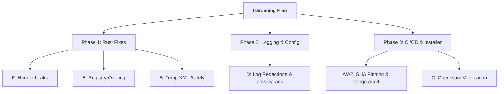

# Security Audit Remediation Comprehensive Action Plan

> **Date**: 2026-06-07  
> **Source Documents**: [20260606T1333-security-audit.md](20260606T1333-security-audit.md)  
> **Project**: `window-switcher`  
> **Remediation Status**: 🔴 **Unimplemented (Verification Pending)**

---

## 1. Introduction & Context

A security audit of the `window-switcher` repository identified seven distinct findings ranging from supply-chain risks in CI/CD to registry configurations, predictable temporary files, debug logs persisting sensitive keystroke data, and kernel handle leaks. 

A verification run conducted on **2026-06-07** confirmed that **none of the seven findings have been implemented** in the codebase. This document serves as the **consolidated, definitive Execution Plan** specifying the security findings, engineering rationales, target code changes, and verification steps.

---

## 2. Rationale & Technical Rationale

This section details why each finding is a security concern, the selected mitigation strategy, and any design choices made during analysis.

### Finding A & A2: Supply-Chain Hardening
* **Risk**: Workflows that grant write access (`contents: write`) or consume third-party actions using tag-based refs (e.g., `@v6`) are vulnerable to tag-spoofing or force-moves by malicious actors. In addition, missing dependency security scanners allow vulnerable dependencies to pass into build artifacts unnoticed.
* **Mitigation**: Pin all GitHub Actions to their unique, immutable 40-character commit SHAs. Add comments indicating version tags for readability. Introduce `cargo audit` in CI to automatically detect and block build pipelines on known vulnerability alerts.

### Finding B: Predictable Temp Task XML
* **Risk**: When writing scheduled task XML under `env::temp_dir()`, using a fixed filename (`window-switcher-task.xml`) enables same-user race conditions, symlink attacks, or file tampering. Because the task executes at `HighestAvailable` (administrator level), this represents a local privilege escalation vector.
* **Design Decision**: A complete Task Scheduler COM API integration is rejected as over-engineered and disproportionate since it requires apartment initialization and full object model conversions. Instead, the risk is mitigated by generating an unguessable filename derived from `CoCreateGuid` and wrapping the file path in a custom RAII guard (`TempFileGuard`) that guarantees file removal upon deletion or exit. *Note on residual risk*: Although GUID-based names prevent symlink hijacking and predictable path creation, a concurrent process running under the same user could still enumerate `%TEMP%` and attempt to alter the XML file between `fs::write` and `schtasks` execution (TOCTOU). This is a known limitation accepted under the single-user threat model.

### Finding C: Installer Integrity Verification
* **Risk**: The installation script `install.ps1` pulls releases from GitHub and extracts them without checking integrity. The `README.md` advertises a raw PowerShell command execution line (`iwr ... | iex`) which lacks download verification.
* **Mitigation**: Update the release workflow to calculate SHA256 checksums and upload them alongside the releases. `install.ps1` must retrieve the SHA256 sum, calculate the file hash, and abort extraction if there is a mismatch. The one-liner in the README will be replaced with instructions to download and inspect the installer.

### Finding D: Keystroke and Metadata Logging
* **Risk**: If debug logging is enabled, raw keystroke events (scan codes), active window titles, and full executable paths are logged to disk. This constitutes a severe privacy risk (e.g., capturing password patterns).
* **Mitigation**: Strip raw key logs, redact window titles to counts or shapes, and log basename-only references for executables. Introduce a configuration key `[log] privacy_ack = yes` that the user must explicitly set in `window-switcher.ini` to enable logging.

### Finding E: Unquoted Startup Registry Command
* **Risk**: Windows Registry auto-start entries (`HKCU\...\Run`) with spaces in executable paths can be parsed ambiguously by the system command processor.
* **Mitigation**: Surround the path in double quotes when writing to the registry. Retain standard unquoted comparisons as a legacy fallback in `reg_is_enable` to prevent breaking existing startup entries for upgrading users.

### Finding F: Process Handle Leaks
* **Risk**: Functions using `OpenProcess` to read module paths or elevation status do not close the opened handles. In a long-running tray utility that lists windows frequently, this leads to system handle leaks.
* **Mitigation**: Wrap all process handles using the existing RAII `HandleWrapper` to ensure handles are automatically closed when they go out of scope.

---

## 3. Engineering Action Plan & Code Changes



### [Phase 1] Code Fixes (Low Severity & Temp Files)

#### 1. Handle Leak Remediation (Finding F)
Wrap process handles returned by `OpenProcess` in `HandleWrapper` so that they close automatically.

* **File**: [src/utils/window.rs](file:///c:/Users/tech/Workspace/Open%20Sources/window-switcher/src/utils/window.rs)
  * Add `use super::HandleWrapper;`
  * Modify `get_module_path` (Line 125):
  ```rust
  pub fn get_module_path(pid: u32) -> Option<String> {
      let handle = HandleWrapper::new(unsafe { OpenProcess(PROCESS_QUERY_LIMITED_INFORMATION, false, pid) }.ok()?);
      let mut len: u32 = MAX_PATH;
      let mut name = vec![0u16; len as usize];
      let ret = unsafe {
          QueryFullProcessImageNameW(
              handle.get_handle(),
              PROCESS_NAME_WIN32,
              PWSTR(name.as_mut_ptr()),
              &mut len,
          )
      };
      if ret.is_err() || len == 0 {
          return None;
      }
      unsafe { name.set_len(len as usize) };
      let module_path = String::from_utf16_lossy(&name);
      if module_path.is_empty() {
          return None;
      }
      Some(module_path)
  }
  ```

* **File**: [src/utils/admin.rs](file:///c:/Users/tech/Workspace/Open%20Sources/window-switcher/src/utils/admin.rs)
  * Modify `is_process_elevated` (Line 25):
  ```rust
  pub fn is_process_elevated(pid: u32) -> Option<bool> {
      let process = HandleWrapper::new(unsafe { OpenProcess(PROCESS_QUERY_LIMITED_INFORMATION, false, pid) }.ok()?);
      get_process_elevation_info(process.get_handle()).ok()
  }
  ```

#### 2. Registry Command Quoting (Finding E)
Quote the executable path saved to the startup registry value (`HKCU\Software\Microsoft\Windows\CurrentVersion\Run`) while preserving upgrade compatibility.

* **File**: [src/startup.rs](file:///c:/Users/tech/Workspace/Open%20Sources/window-switcher/src/startup.rs)
  * Add `quoted_exe_value` helper to format paths with quotes.
  ```rust
  fn quoted_exe_value(exe_path: &[u16]) -> Vec<u16> {
      let mut clean = exe_path.to_vec();
      if clean.last() == Some(&0) {
          clean.pop();
      }
      let mut quoted = Vec::with_capacity(clean.len() + 2);
      quoted.push(0x0022); // '"'
      quoted.extend(clean);
      quoted.push(0x0022); // '"'
      quoted
  }
  ```
  * Update `reg_enable` and `reg_is_enable`:
  ```rust
  fn reg_is_enable(exe_path: &[u16]) -> Result<bool> {
      let key = reg_key()?;
      let value = match key.get_value()? {
          Some(value) => value,
          None => return Ok(false),
      };
      let quoted = quoted_exe_value(exe_path);
      Ok(value == quoted || value == exe_path)
  }

  fn reg_enable(exe_path: &[u16]) -> Result<()> {
      let key = reg_key()?;
      let quoted = quoted_exe_value(exe_path);
      let path = unsafe { quoted.align_to::<u8>().1 };
      key.set_value(path)?;
      Ok(())
  }
  ```

#### 3. Temp XML Protection (Finding B)
Ensure that task XML paths are unique and reliably deleted.

* **File**: [src/utils/scheduled_task.rs](file:///c:/Users/tech/Workspace/Open%20Sources/window-switcher/src/utils/scheduled_task.rs)
  * Add unique path generator, `TempFileGuard`, and XML formatter:
  ```rust
  use windows::Win32::System::Com::CoCreateGuid;

  struct TempFileGuard(std::path::PathBuf);

  impl Drop for TempFileGuard {
      fn drop(&mut self) {
          let _ = std::fs::remove_file(&self.0);
      }
  }

  fn unique_xml_path() -> Result<std::path::PathBuf> {
      let guid = unsafe { CoCreateGuid()? };
      let filename = format!(
          "window-switcher-task-{:08x}-{:04x}-{:04x}-{:02x}{:02x}-{:02x}{:02x}{:02x}{:02x}{:02x}{:02x}.xml",
          guid.data1, guid.data2, guid.data3,
          guid.data4[0], guid.data4[1], guid.data4[2], guid.data4[3],
          guid.data4[4], guid.data4[5], guid.data4[6], guid.data4[7]
      );
      Ok(env::temp_dir().join(filename))
  }

  fn format_task_xml(name: &str, exe_path: &str) -> Result<String> {
      let (author, user_id) = get_author_and_userid()
          .map_err(|err| anyhow!("Failed to get author and user id, {err}"))?;
      let current_time = get_current_time();
      let command_path = if exe_path.contains(|c: char| c.is_whitespace()) {
          format!("\"{exe_path}\"")
      } else {
          exe_path.to_string()
      };
      let xml_data = format!(
          r#"<?xml version="1.0" encoding="UTF-16"?>
<Task version="1.2" xmlns="http://schemas.microsoft.com/windows/2004/02/mit/task">
  <RegistrationInfo>
    <Date>{current_time}</Date>
    <Author>{author}</Author>
    <URI>\{name}</URI>
  </RegistrationInfo>
  <Triggers>
    <LogonTrigger>
      <StartBoundary>{current_time}</StartBoundary>
      <Enabled>true</Enabled>
    </LogonTrigger>
  </Triggers>
  <Principals>
    <Principal id="Author">
      <UserId>{user_id}</UserId>
      <LogonType>InteractiveToken</LogonType>
      <RunLevel>HighestAvailable</RunLevel>
    </Principal>
  </Principals>
  <Settings>
    <MultipleInstancesPolicy>IgnoreNew</MultipleInstancesPolicy>
    <DisallowStartIfOnBatteries>false</DisallowStartIfOnBatteries>
    <StopIfGoingOnBatteries>true</StopIfGoingOnBatteries>
    <AllowHardTerminate>true</AllowHardTerminate>
    <StartWhenAvailable>false</StartWhenAvailable>
    <RunOnlyIfNetworkAvailable>false</RunOnlyIfNetworkAvailable>
    <IdleSettings>
      <StopOnIdleEnd>true</StopOnIdleEnd>
      <RestartOnIdle>false</RestartOnIdle>
    </IdleSettings>
    <AllowStartOnDemand>true</AllowStartOnDemand>
    <Enabled>true</Enabled>
    <Hidden>false</Hidden>
    <RunOnlyIfIdle>false</RunOnlyIfIdle>
    <WakeToRun>false</WakeToRun>
    <ExecutionTimeLimit>PT0S</ExecutionTimeLimit>
    <Priority>7</Priority>
  </Settings>
  <Actions Context="Author">
    <Exec>
      <Command>{command_path}</Command>
    </Exec>
  </Actions>
</Task>"#
      );
      Ok(xml_data)
  }
  ```
  * Refactor XML generation and cleanup in `create_scheduled_task`:
  ```rust
  pub fn create_scheduled_task(name: &str, exe_path: &str) -> Result<()> {
      let task_xml_path = unique_xml_path()?;
      let xml_data = format_task_xml(name, exe_path)?;
      fs::write(&task_xml_path, xml_data)?;

      let _guard = TempFileGuard(task_xml_path.clone());
      let task_xml_str = task_xml_path.display().to_string();

      let output = Command::new("schtasks")
          .creation_flags(CREATE_NO_WINDOW.0)
          .args(["/create", "/tn", name, "/xml", &task_xml_str, "/f"])
          .output()?;
      if !output.status.success() {
          bail!("Fail to create scheduled task, {}", String::from_utf8_lossy(&output.stderr));
      }
      Ok(())
  }
  ```

---

### [Phase 2] Logging Configuration & Privacy (Finding D)

#### 1. Keystroke Logging Redaction
* **File**: [src/keyboard.rs](file:///c:/Users/tech/Workspace/Open%20Sources/window-switcher/src/keyboard.rs)
  * Remove `debug!("keyboard {kbd_data:?}");` (Line 97) or replace it with a non-sensitive log statement:
  ```rust
  debug!("keyboard hook event triggered");
  ```

#### 2. Metadata Logging Redaction
* **File**: [src/utils/window.rs](file:///c:/Users/tech/Workspace/Open%20Sources/window-switcher/src/utils/window.rs)
  * Modify debug log inside `list_windows` (Line 495) to output only the size/number of active items instead of raw window details:
  ```rust
  debug!("list windows count: {}", result.len());
  ```
* **File**: [src/foreground.rs](file:///c:/Users/tech/Workspace/Open%20Sources/window-switcher/src/foreground.rs)
  * Redact executable name from foreground event log (Line 81):
  ```rust
  debug!("foreground event triggered, blacklist match: {is_in_blacklist}");
  ```

#### 3. Privacy Acknowledgment Opt-In
* **File**: [src/config.rs](file:///c:/Users/tech/Workspace/Open%20Sources/window-switcher/src/config.rs)
  * Add `privacy_ack` field to `Config`:
  ```rust
  pub struct Config {
      // ...
      pub log_privacy_ack: bool,
  }
  ```
  * Update `Default` implementation for `Config`:
  ```rust
  impl Default for Config {
      fn default() -> Self {
          Self {
              // ...
              log_privacy_ack: false,
          }
      }
  }
  ```
  * Parse `privacy_ack` in `Config::load`:
  ```rust
  if let Some(v) = section.get("privacy_ack").and_then(Config::to_bool) {
      conf.log_privacy_ack = v;
  }
  ```
* **File**: [src/main.rs](file:///c:/Users/tech/Workspace/Open%20Sources/window-switcher/src/main.rs)
  * Block log preparation and print warning to console if acknowledgment is missing, preserving path context on failures:
  ```rust
  if let Some(log_file) = &config.log_file {
      if !config.log_privacy_ack {
          eprintln!("Logging configuration detected, but `privacy_ack = yes` is not set under [log] in `window-switcher.ini`. Logging is disabled to protect your privacy.");
      } else {
          let file = prepare_log_file(log_file).map_err(|err| {
              anyhow!(
                  "Failed to prepare log file at {}, {err}",
                  log_file.display()
              )
          })?;
          simple_logging::log_to(file, config.log_level);
      }
  }
  ```

---

### [Phase 3] Workflow, Installer, and Documentation (Findings A, A2, C)

#### 1. Supply-Chain Hardening & Security Gates (Finding A, A2)
* **File**: [.github/workflows/ci.yaml](file:///c:/Users/tech/Workspace/Open%20Sources/window-switcher/.github/workflows/ci.yaml)
  * Pin actions to commit SHAs:
    * `actions/checkout@v6` -> `actions/checkout@11bd71901bbe5b1630ceea73d27597364c9af683` `# v4.2.2`
    * `dtolnay/rust-toolchain@stable` -> `dtolnay/rust-toolchain@29eef336d9b2848a0b548edc03f92a220660cdb8` `# stable`
    * `Swatinem/rust-cache@v2` -> `Swatinem/rust-cache@82a92a6e8fbeee089604da2575dc567ae9ddeaab` `# v2.7.5`
  * Add a `cargo audit` step:
  ```yaml
  - name: Run Cargo Audit
    uses: rustsec/audit-check@69366f33c96575abad1ee0dba8212993eecbe998 # v2.0.0
    with:
      token: ${{ secrets.GITHUB_TOKEN }}
  ```

* **File**: [.github/workflows/release.yaml](file:///c:/Users/tech/Workspace/Open%20Sources/window-switcher/.github/workflows/release.yaml)
  * Pin actions to commit SHAs:
    * `actions/checkout@v6` -> `actions/checkout@11bd71901bbe5b1630ceea73d27597364c9af683` `# v4.2.2`
    * `dtolnay/rust-toolchain@stable` -> `dtolnay/rust-toolchain@29eef336d9b2848a0b548edc03f92a220660cdb8` `# stable`
    * `taiki-e/install-action@v2` -> `taiki-e/install-action@510b3ecd7915856b6909305605afa7a8a57c1b04` `# v2.48.1`
    * `softprops/action-gh-release@v2` -> `softprops/action-gh-release@c95fe1489396fe8a9eb87c0abf8aa5b2ef267fda` `# v2.2.1`

#### 2. Checksum Attestation & Verification (Finding C)
* **File**: [.github/workflows/release.yaml](file:///c:/Users/tech/Workspace/Open%20Sources/window-switcher/.github/workflows/release.yaml)
  * Append checksum calculations inside `Build Archive` (Line 77):
  ```bash
  # Inside packaging script...
  sha256sum $name.zip > $name.zip.sha256
  echo "archive=dist/$name.zip" >> $GITHUB_OUTPUT
  echo "checksum=dist/$name.zip.sha256" >> $GITHUB_OUTPUT
  ```
  * Update release publish step to include the checksum output path and restore prerelease logic:
  ```yaml
  - name: Publish Archive
    uses: softprops/action-gh-release@c95fe1489396fe8a9eb87c0abf8aa5b2ef267fda # v2.2.1
    if: ${{ startsWith(github.ref, 'refs/tags/') }}
    with:
      draft: false
      files: |
        ${{ steps.package.outputs.archive }}
        ${{ steps.package.outputs.checksum }}
      prerelease: ${{ steps.check-tag.outputs.rc == 'true' }}
  ```

* **File**: [install.ps1](file:///c:/Users/tech/Workspace/Open%20Sources/window-switcher/install.ps1)
  * Implement hash validation:
  ```powershell
  $checksumUrl = "$archive.sha256"
  $checksumFile = New-TemporaryFile
  try {
      Invoke-WebRequest -Uri $checksumUrl -OutFile $checksumFile -UseBasicParsing -ErrorAction Stop | Out-Null
  } catch {
      Write-Error "Failed to fetch release checksum file."
      exit 1
  }

  $expectedHash = (Get-Content $checksumFile).Split(" ")[0].Trim()
  $actualHash = (Get-FileHash -Path $temp -Algorithm SHA256).Hash.ToLower()

  if ($expectedHash -ne $actualHash) {
      Write-Error "Download hash verification failed! Exiting."
      exit 1
  }
  ```

* **File**: [README.md](file:///c:/Users/tech/Workspace/Open%20Sources/window-switcher/README.md)
  * Replace the automated one-liner `iwr ... | iex` (Lines 21-24) with standard download & review steps.
  * Document the `[log] privacy_ack = yes` flag inside the `Configuration` section.

---

## 4. Verification & Testing Checklist

- [ ] **Handle Leaks (Finding F)**: Run `cargo run` and switch windows repeatedly. Check the Process handle count in Task Manager/Process Explorer to confirm no handle count increases.
- [ ] **Registry Quoting (Finding E)**: Enable startup as standard user. Verify that `HKCU\Software\Microsoft\Windows\CurrentVersion\Run` key contains values wrapped in double quotes. Turn startup off, then verify the registry value is cleared. Verify that an unquoted legacy key reads as "enabled" without errors.
- [ ] **Temp File Security (Finding B)**: Enable startup elevated. Verify that a uniquely named GUID XML is created in the temp directory, then verify it is automatically deleted after `schtasks` is executed.
- [ ] **Sanitized Logging (Finding D)**: Configure debug logs. Verify that keystrokes log generic event markers instead of key structures. Verify that window titles and full executable paths do not appear in log files.
- [ ] **Privacy Opt-In Acknowledgment (Finding D)**: Verify that configured logs do not start unless `privacy_ack = yes` is parsed in the configuration, showing an alert instead.
- [ ] **Workflow Integrity (Finding A/A2)**: Validate YAML workflows parse. Run a manual or scheduled CI job to confirm `cargo audit` correctly checks dependencies.
- [ ] **Checksum Matching (Finding C)**: Execute `install.ps1` end-to-end to ensure it downloads the checksum file, verifies the package hash, and errors out if a mismatched/tampered archive is downloaded.
